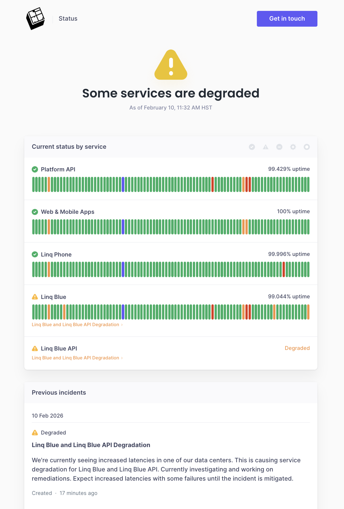

# Blooio AI Agent Example

An AI-powered iMessage agent built on the [Blooio API](https://blooio.com). Uses Claude (Anthropic) to chat with people over iMessage, complete with web search, image generation, reactions, voice memo transcription, and more.

Get it running in under a minute.

---

## Why Blooio?

If you've used Linq Blue, you already know the pain: opaque pricing, $500+ setup fees, no public API docs, and unreliable delivery.



Blooio is a modern replacement with transparent pricing, public API documentation, and features Linq doesn't support like RCS, iMessage effects, and message reactions.

| | Blooio | Linq Blue |
|---|---|---|
| Setup fees | None | $500+ |
| Pricing | [Transparent](https://blooio.com/pricing) | Must book a call |
| Free trial | Yes, no credit card | No |
| API docs | [Public](https://docs.blooio.com) | None |
| RCS support | Yes | No |
| iMessage effects | Yes | No |
| Message reactions | Yes | No |
| MCP server | Yes | No |

[Full comparison: Blooio vs Linq Blue](https://blooio.com/compare/blooio-vs-linq-blue)

---

## Quick Start (< 1 minute)

### 1. Get a Blooio API key

1. Go to [app.blooio.com](https://app.blooio.com)
2. Redeem the free trial (no credit card required)
3. Create an API key and attach it to your number

### 2. Set up your environment

```bash
git clone https://github.com/blooio/ai-agent-example.git
cd ai-agent-example
cp .env.example .env
```

Edit `.env` and add your keys:

```
ANTHROPIC_API_KEY=sk-ant-xxx        # from console.anthropic.com
BLOOIO_API_KEY=your_blooio_key      # from app.blooio.com
OPENAI_API_KEY=sk-xxx               # optional, for image gen + voice memos
```

### 3. Install and run

```bash
npm install
npm run dev
```

### 4. Expose your server and register the webhook

Use [cloudflared](https://developers.cloudflare.com/cloudflare-one/connections/connect-networks/downloads/) (or ngrok) to create a public tunnel:

```bash
cloudflared tunnel --url http://localhost:3000
```

Then register the tunnel URL as your Blooio webhook:

```bash
curl -X POST https://backend.blooio.com/v2/api/webhooks \
  -H "Authorization: Bearer YOUR_BLOOIO_API_KEY" \
  -H "Content-Type: application/json" \
  -d '{
    "webhook_url": "https://YOUR-TUNNEL-URL/webhook",
    "webhook_type": "message",
    "valid_until": -1
  }'
```

### 5. Text your number

That's it. Send a text to your Blooio number and the AI agent will respond.

---

### Let AI do the setup for you

If you use an AI coding assistant (Cursor, Codex, Copilot, etc.), just paste this:

> Spin up the Blooio AI agent. Install deps, start the dev server, create a cloudflared tunnel, then call the Blooio webhook API to register the tunnel URL. My Blooio API key is in .env.

The AI will handle the tunnel creation and webhook registration automatically.

---

## Features

- **Claude AI responses** - Conversational AI via iMessage
- **Web search** - Real-time info (weather, news, sports, etc.)
- **Image generation** - Create images via DALL-E 3
- **Image analysis** - Send photos and Claude analyzes them
- **iMessage reactions** - Claude can react with tapbacks (love, like, laugh, etc.)
- **Typing indicators** - Shows typing while Claude thinks
- **Voice memo transcription** - Transcribes voice memos via OpenAI Whisper
- **Conversation memory** - Remembers context per chat (1 hour TTL)
- **User profiles** - Remembers names and facts about people permanently
- **Group chat awareness** - Detects group chats and adjusts behavior
- **Smart group chat filtering** - Uses Haiku to decide if Claude should respond, react, or ignore
- **Group chat renaming** - Claude can rename group chats when asked
- **Group chat icons** - Claude can generate and set group chat icons
- **Multi-message responses** - Sends multiple short messages like a real person
- **Platform awareness** - Knows if conversation is iMessage, RCS, or SMS

## Configuration

| Variable | Required | Description |
|----------|----------|-------------|
| `ANTHROPIC_API_KEY` | Yes | Claude API key from [Anthropic](https://console.anthropic.com) |
| `BLOOIO_API_KEY` | Yes | API key from [Blooio](https://app.blooio.com) |
| `OPENAI_API_KEY` | No | For DALL-E image generation and Whisper voice transcription |
| `PORT` | No | Server port (default: 3000) |
| `IGNORED_SENDERS` | No | Phone numbers to skip (comma-separated) |
| `ALLOWED_SENDERS` | No | Only respond to these numbers (for dev) |
| `DYNAMODB_TABLE_NAME` | No | DynamoDB table name (default: blooio-agent-example) |

## Commands

Users can text these commands:

- `/clear` - Clear conversation history
- `/forget me` - Erase user profile
- `/help` - Show available commands

## Architecture

```
[User] ──iMessage──> [Blooio] ──webhook──> [This App] ──API──> [Claude]
                                                |                  |
                                                |    <── tools <───|
                                                |    (reactions,   |
                                                |     web search,  |
                                                |     images)      |
                                                |                  v
                                                |              [OpenAI]
                                                |              (DALL-E, Whisper)
                                                v
[User] <──iMessage── [Blooio] <──API───── [Reply + Reactions]
```

### Flow

1. User sends iMessage to your Blooio number
2. Blooio sends webhook to your server
3. App marks chat as read + starts typing indicator
4. If group chat: Haiku decides whether to respond, react, or ignore
5. App sends message + images + context to Claude
6. Claude may use tools (web search, reactions, image generation)
7. App sends response back through Blooio API
8. User receives iMessage reply

## File Structure

```
src/
├── index.ts              # Express app, webhook handler, main flow
├── blooio/
│   └── client.ts         # Blooio API functions
├── claude/
│   └── client.ts         # Claude integration, tools, system prompt
├── webhook/
│   ├── handler.ts        # Webhook processing
│   └── types.ts          # TypeScript types for Blooio webhooks
└── state/
    └── conversation.ts   # DynamoDB storage (conversations + user profiles)
```

## Models Used

- **Claude Sonnet 4** - Main conversational responses
- **Claude Haiku 3.5** - Fast group chat filtering decisions

## API Documentation

- Blooio API docs: [docs.blooio.com](https://docs.blooio.com)
- Blooio OpenAPI spec: [backend.blooio.com/v2/api/openapi.json](https://backend.blooio.com/v2/api/openapi.json)

## License

MIT
